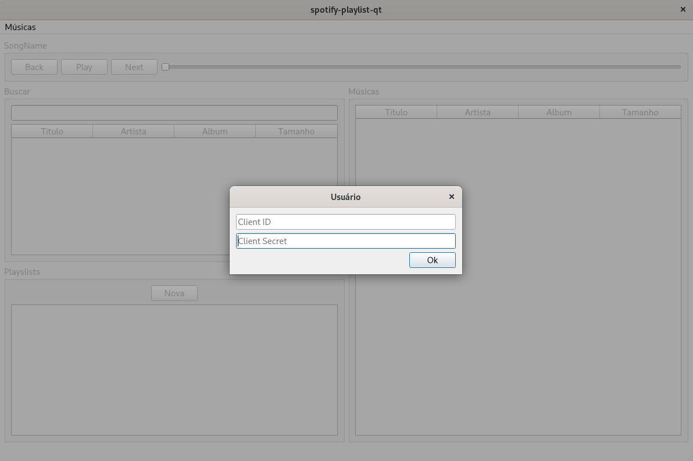
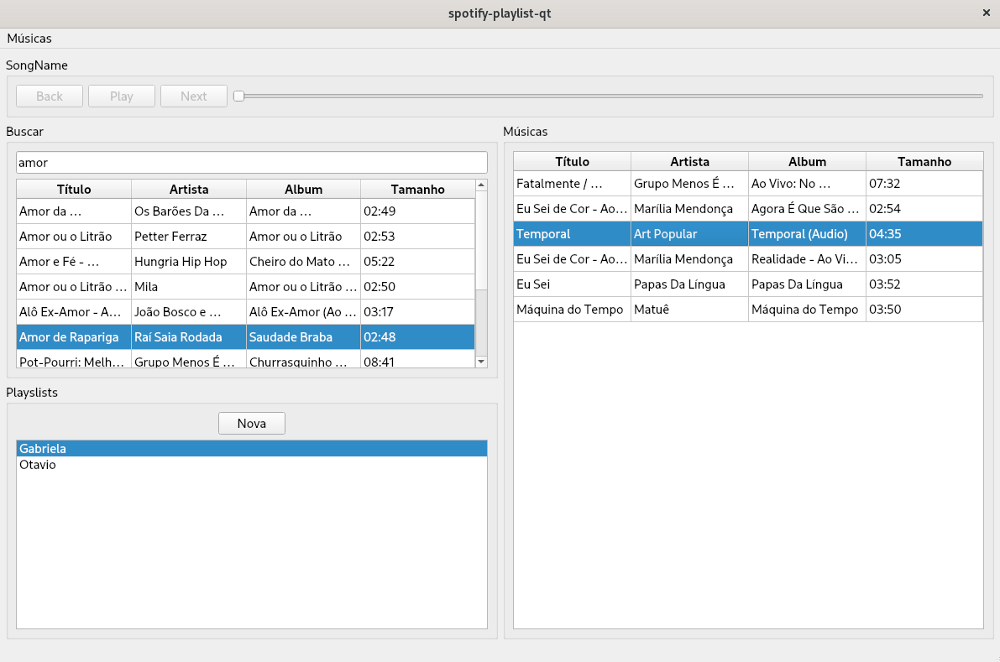

## spotify-playlist-qt

Este projeto apresenta uma aplicação de criação e gerenciamento de Playlist do Spotify utilizando o Qt.

## O que a aplicação suporta
* Fluxo de Autorização
* Buscar músicas
* Criar e remover Playlists
* Adicionar e remover Músicas da Playlist

## Como usar
Ao iniciar a aplicação, clique em `Músicas` e em seguida em `Usuário`. Uma nova janela abrirá e você deve colocar o seu "Client ID" e "Client Secret". É preciso também configurar um callback no [Dashboard](https://developer.spotify.com/dashboard/applications) do Spotify. O callback que esta aplicação está utilizando é: http://127.0.0.1:8080/ Depois clique em `Conectar API`. Se as credenciais e o callback estiver configurado corretamente, a aplicação agora está conectada ao Spotify.

    

Com a aplicação conectada, você pode ir em `Buscar` e digitar a música que está procurando e clicar `Enter`. O resultado de seu busca aparecerá logo embaixo. Para adicionar uma música a `Playlist` basta clicar duas vezes na música. Você pode criar uma nova `Playlist` clicando no botão `Nova`, para deletar uma `Playlist` clique duas vezes nela. Se quiser remover uma música da `Playlist`, clique duas vezes na música que deseja retirar.

    

## Próximos Passos
* Ainda não estou conseguindo tocar a música selecionada, estou com algum erro no PUT request
* Colocar testes unitários cobrindo o código todo
* Adicionar CIs (provavelmente GitHub Actions)
* Melhoras no código (eliminar código repetido)